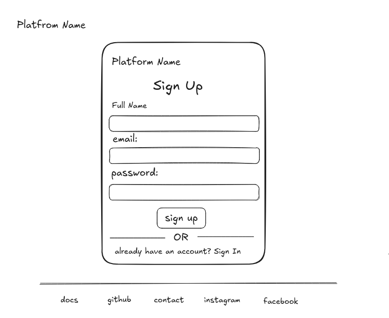
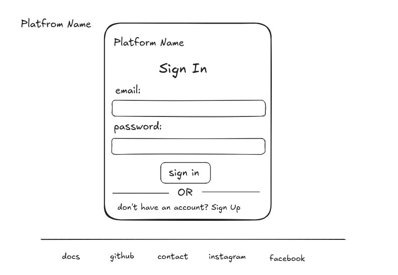
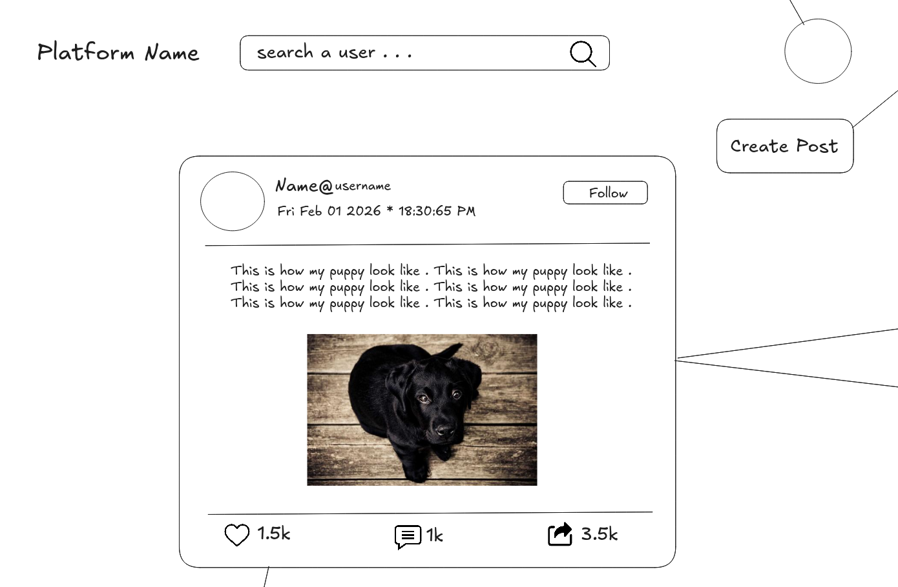
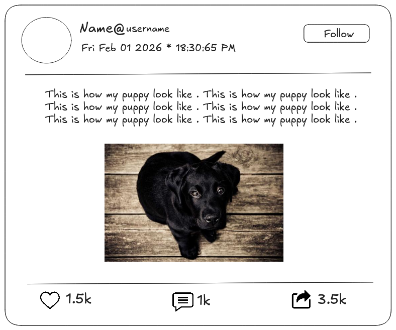
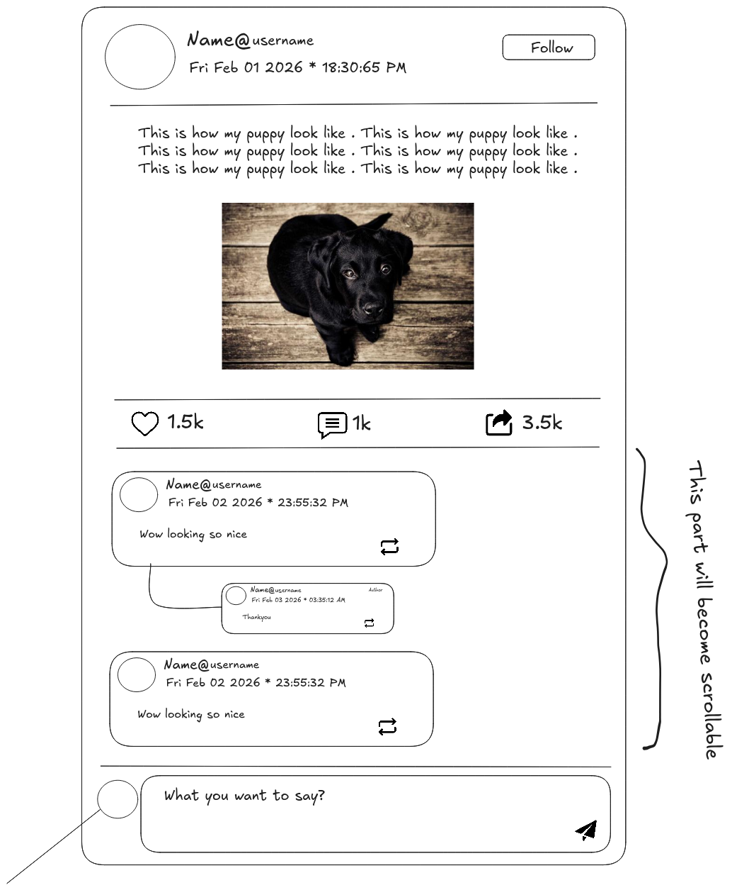
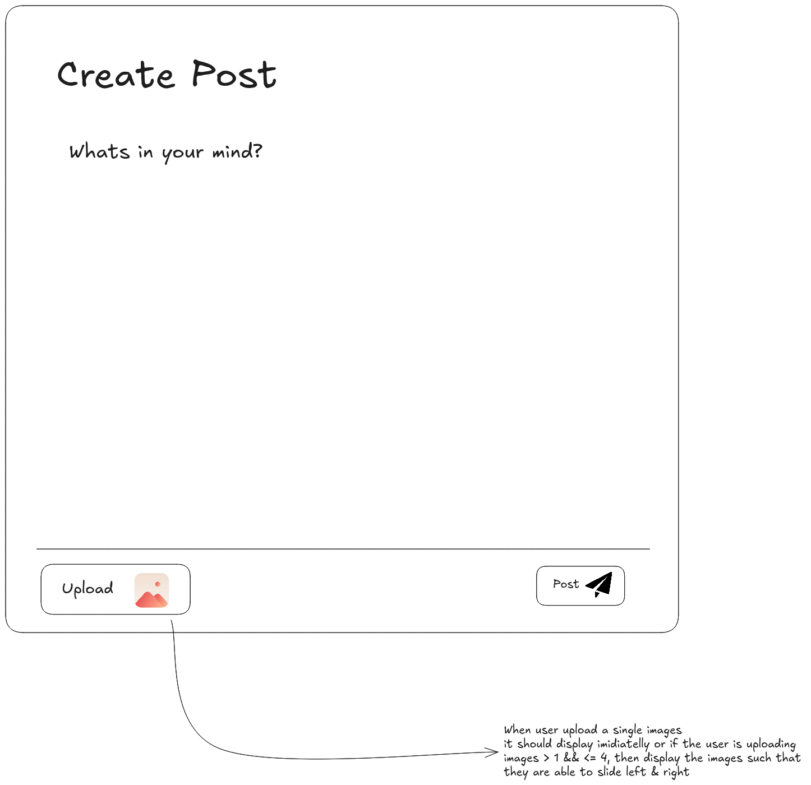
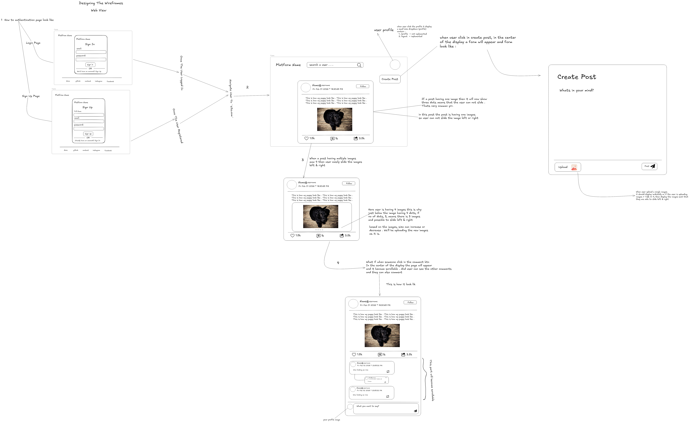

# Project Architecture & Design Documentation

---

## 📖 Overview
This document outlines the architectural flow, entity relationships, and user interface design of the **Social Post Application**. It serves as a guide for understanding how the frontend interacts with the backend and how users experience the platform.

---

## 🔐 1. The Authentication Process

The application uses a secure **JWT (JSON Web Token)** based authentication system with **HTTP-Only Cookies** to ensure user session security.

### **A. Sign Up (Registration)**
* **Entry Point:** Users visiting the platform for the first time are directed to `/signup` (or a modal).
* **Required Data:**
    * `Full Name`: Display name of the user.
    * `Email`: Unique identifier.
    * `Password`: Must be at least **8 characters** long.
* **Process:**
    1.  Frontend sends data to `POST /api/v1/user/auth/register`.
    2.  Backend hashes the password (using bcrypt) and creates a user in MongoDB.
    3.  Backend generates an **Access Token** and a **Refresh Token**.
    4.  Tokens are sent back via **HTTP-Only Cookies** (for security) or Response Body.
* **Post-Action:** User is automatically redirected to the **Feed** (`/`).

### **B. Sign In (Login)**
* **Entry Point:** Existing users visit `/login`.
* **Required Data:** `Email` & `Password`.
* **Process:**
    1.  Frontend sends credentials to `POST /api/v1/user/auth/login`.
    2.  Backend verifies password hash.
    3.  On success, new tokens are issued.
* **Post-Action:** User is redirected to the **Feed** (`/`).

---

## 👤 2. User Capabilities & Features

An authenticated user has access to the following core features:
* **Create Posts:** Upload text content and images (stored via Cloudinary).
* **View Feed:** Access a global stream of posts using **Infinite Scrolling**.
* **Interactions:**
    * **Like:** Toggle like status on posts.
    * **Comment:** Add text comments to discussions.
* **Navigation:** Seamlessly navigate between the Home Feed and other potential pages (Profile, Settings).

---

## 🎨 3. Wireframes & UI Design

The application follows a **Mobile-First Design** philosophy. The interface is clean, responsive, and focused on content consumption.

### **A. Sign Up Page (`/signup`)**
  
* **Layout:** Centered Card on a clean background.
* **Components:**
    * **Header:** "Platform Name".
    * **Input Fields:**
        * Full Name (Text)
        * Email Address (Email)
        * Password (Password, masked)
    * **Primary Button:** "Sign Up" (Middle).
    * **Footer Link:** "Already have an account? **SignIn**".

### **B. Sign In Page (`/login`)**
  
* **Layout:** Similar to Signup for consistency.
* **Components:**
    * **Header:** "Platform Name".
    * **Input Fields:**
        * Email Address
        * Password
    * **Primary Button:** "Sign In".
    * **Footer Link:** "Don't have an account? **Sign Up**".

### **C. Home Feed (`/`) - The Core Experience**
  
* **Layout:** Single column layout (max-width ~600px for desktop) to mimic a mobile timeline.
* **Header (Navbar):**
    * **Left:** Platform Name.
    * **Right:** User Profile Avatar .
* **Create Post Section (Top of Feed):**
    * Button: "click on the "create post" button".
    * Form: A form will appear in the center, you can enter details what you want to post.
    * "Post" Button.
* **Post Stream (Infinite Scroll):**
    * Posts appear one after another.
    * As the user scrolls to the bottom, a **Loading Spinner** appears, and the next batch of 10 posts is fetched automatically.

### **D. Post Card UI**
  
Each post in the feed follows this structure:
1.  **Header:**
    * **Avatar:** User's profile picture (Circle).
    * **Name & Timestamp:** e.g., "Afzal@iamafzal • Fri Feb 2 2026 • 12:45:32 AM".
2.  **Content Body:**
    * **Text:** displayed clearly with hashtag support (optional).
    * **Image Gallery:** If images exist, they are displayed in a responsive grid or carousel.
3.  **Action Bar (Bottom):**
    * **❤️ Like Button:** Shows like count. Changes color when active.
    * **💬 Comment Button:** Shows comment count. Toggles the Comment Section.

### **E. Comment UI (Expandable)**
  
When a user clicks the "Comment" button on a post:
* **Input Area:** Appears the post immediately just above the display & make the comment section scrolable.
    * Text Input: "Write a comment..."
    * Send Button (Icon).
* **Comment List:**
    * Displays existing comments in chronological order.
    * **Format:** User Name (Bold) + Comment Text.
    * *timestamp*.

### **E. Creating Post**
  
When a user clicks the "create post" button:
* **A form:** Appears immediately in the center of the display.
    * Text Input: "Write is in your mind..."
    * Buttons: 
        * Camera: User can add images . User can add 1 images also and more than 1 but less then 5,
        * Post: When click in the post button, it will create a new post

--- 

### Full Wireframe Image  
  
> Please checkout the link if you want to see the details about wireframe : `https://excalidraw.com/#json=PoTqAsVoh5i2wSue3WGEK,JpTDUoEBdg9kn628mQS1Fg`  

## 🛠️ 4. Technical Frontend Architecture

* **Framework:** React (Vite).
* **State Management:** React `useState` & `useEffect` (for handling feed data and pagination).
* **Styling:** Basic CSS & MUI.
* **Optimization:**
    * **Infinite Scroll:** Uses `IntersectionObserver` API or scroll event listeners to detect bottom of page.
    * **Image Optimization:** Cloudinary URLs are used to serve optimized images.